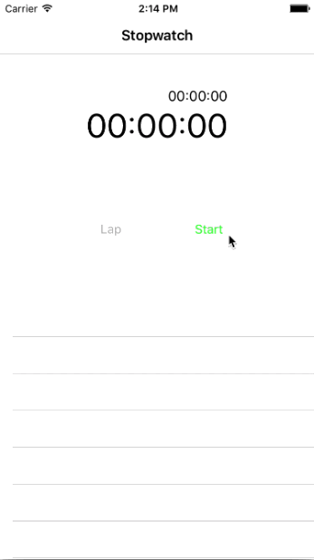

Stopwatch
==========
Stopwatch is an iOS App that measures amount of time elapsed from a particular time at the initial stage. It highly mocks the stopwatch of Apple's offical App called Clock. This app supports functions such as lap record, time resume, and stopwatch reset.

## Screenshots

